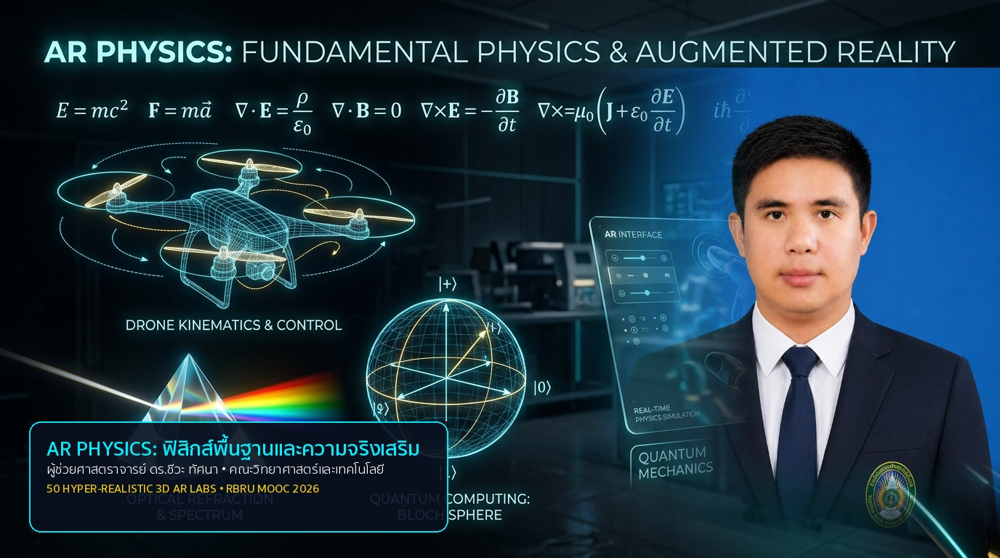

# AR PHYSICS: ฟิสิกส์พื้นฐานและความจริงเสริม
> **Fundamental Physics & Augmented Reality with MediaPipe AI Hand Tracking**  
> **Course Code**: 4121103 (3 Credits) | **RBRU MOOC 2026 Edition**  
> **Instructor**: Asst. Prof. Dr. Chewa Thassana (ผู้ช่วยศาสตราจารย์ ดร.ชีวะ ทัศนา)  
> **Affiliation**: Department of Physics, Faculty of Science and Technology, Rambhai Barni Rajabhat University (RBRU)

---

## 🌟 Overview (ภาพรวมรายวิชา)
**AR PHYSICS (ฟิสิกส์พื้นฐานและความจริงเสริม)** เป็นนวัตกรรมชุดการเรียนการสอนรายวิชาฟิสิกส์ระดับอุดมศึกษาที่บูรณาการเทคโนโลยีความเป็นจริงเสริม (**WebXR / Augmented Reality**) และระบบปัญญาประดิษฐ์ตรวจจับท่าทางมือ 3 มิติ (**MediaPipe Hands 21-Joint 3D Tracking**) ร่วมกับ **Three.js & A-Frame PBR Physical Shaders** และ **Web Audio API Live Acoustic Synthesizers** ทำให้นักศึกษาสามารถทำการทดลองฟิสิกส์เสมือนจริงได้สมจริงแบบเรียลไทม์ 60 FPS ผ่านเว็บเบราว์เซอร์และกล้องเว็บแคมโดยไม่ต้องติดตั้งโปรแกรมเพิ่มเติม

---

## 🖼️ Course Banner & Textbook Cover


---

## 🔬 50 Hyper-Realistic 3D AR MediaPipe Simulators (ชุด 50 ห้องปฏิบัติการเสมือนจริง):

| บทที่ | ชื่อบทเรียน | 5 ห้องปฏิบัติการเสมือนจริง AR MediaPipe (Hyper-Realistic Edition) |
| :---: | :--- | :--- |
| **บทที่ 1** | **การวัด หน่วย และเวกเตอร์ 3 มิติ** | • AR Laser Metrology<br>• AR Micrometer Caliper<br>• AR 6-DOF IMU Sensor<br>• AR 3D Vector Cross Product<br>• AR Sensor Error Calibration |
| **บทที่ 2** | **จลนศาสตร์และการเคลื่อนที่ในยานยนต์ AI** | • AR Vision Radar Range<br>• AR Autonomous Safe Stopping<br>• AR Kinematics 5-Equation<br>• AR Parabolic Trajectory<br>• AR HUD Trajectory Telemetry |
| **บทที่ 3** | **แรง กฎนิวตัน และหุ่นยนต์อัจฉริยะ** | • AR Inverted Pendulum Robot<br>• AR Newton 2nd Law Atwood<br>• AR 3D Friction Tribometer<br>• AR Inclined Plane Normal Force<br>• AR 3-DOF Robotic Arm Torque |
| **บทที่ 4** | **งาน พลังงาน และการอนุรักษ์พลังงานใน AI** | • AR Energy Roller Coaster<br>• AR Hooke Spring Work-Energy<br>• AR EV Regenerative Braking<br>• AR Smart Solar PV Efficiency<br>• AR AI Green Data Center Heat |
| **บทที่ 5** | **โมเมนตัม การชน และถุงลมนิรภัย AI** | • AR 2D/3D Collision Arena<br>• AR Impulse Crumple Zone<br>• AR Smart Airbag 30ms<br>• AR Ballistic Pendulum<br>• AR Crash Test Dummy HIC |
| **บทที่ 6** | **กลศาสตร์ของไหล อากาศพลศาสตร์ และโดรน** | • AR Bernoulli Venturi Tube<br>• AR Archimedes Submarine<br>• AR Drone Quadcopter Thrust<br>• AR Airfoil Wind Tunnel Stall<br>• AR AI Fluid Dynamics CFD |
| **บทที่ 7** | **อุณหพลศาสตร์ ความร้อน และระบบหล่อเย็น AI** | • AR Heat vs Temp Calorimeter<br>• AR Carnot Inverter Heat Pump<br>• AR AI Immersion Cooling<br>• AR 3D Heat Transfer Modes<br>• AR Thermal Infrared Building Scan |
| **บทที่ 8** | **คลื่น เสียง และการประมวลผลสัญญาณ AI** | • AR Wave Superposition<br>• AR Active Noise Cancelling (ANC)<br>• AR FFT Speech Spectrogram<br>• AR Acoustic Harmonics Synthesizer<br>• AR Decibel Sound Dosimeter |
| **บทที่ 9** | **แสง ทัศนศาสตร์ และคอมพิวเตอร์วิทัศน์ AI** | • AR Snell Refraction Prism<br>• AR Structured Light 3D Face ID<br>• AR AR/VR Pancake Waveguide<br>• AR Thin Lens Ray Tracing<br>• AR CNN Convolution Sobel Kernel |
| **บทที่ 10**| **ฟิสิกส์ยุคใหม่ ควอนตัมคอมพิวติง และ AI อนาคต** | • AR Quantum Bloch Sphere<br>• AR Nuclear PET Scan AI<br>• AR Quantum Entanglement QNN<br>• AR Spacetime Relativity Black Hole<br>• AR Grand Physics-AI Synthesis |

---

## 🛠️ Tech Stack & Key Features
* **Core 3D Engine**: Three.js & A-Frame (r1.4.2) with PBR Metallic-Roughness Physical Materials
* **AI Hand Tracking**: MediaPipe Hands (Zero Latency 60 FPS, 21-Joint 3D Hand Topology & Pinch Gestures)
* **Real-time Acoustic Physics**: Web Audio API Synthesizers (Frequency Modulated Oscillators & Sound FX)
* **Vector Mathematics & Graphics**: MathJax LaTeX Formulas & Crisp 3D Animated SVGs
* **E-Learning LMS Integration**: Seamless deployment on Moodle LMS & RBRU MOOC Platform

---

## 🚀 Quick Start
```bash
# Clone the repository
git clone https://github.com/jirapatc-microb/ar-physics.git

# Open any simulator directly in your browser
open simulators/chapter01_sec0_ar_laser_measurement.html
```

---

## 👨‍🏫 Instructor & Credits
* **ผู้ช่วยศาสตราจารย์ ดร.ชีวะ ทัศนา (Asst. Prof. Dr. Chewa Thassana)**
* สาขาวิชาฟิสิกส์ คณะวิทยาศาสตร์และเทคโนโลยี มหาวิทยาลัยราชภัฏรำไพพรรณี (RBRU)
* © 2026 Rambhai Barni Rajabhat University. All rights reserved.
